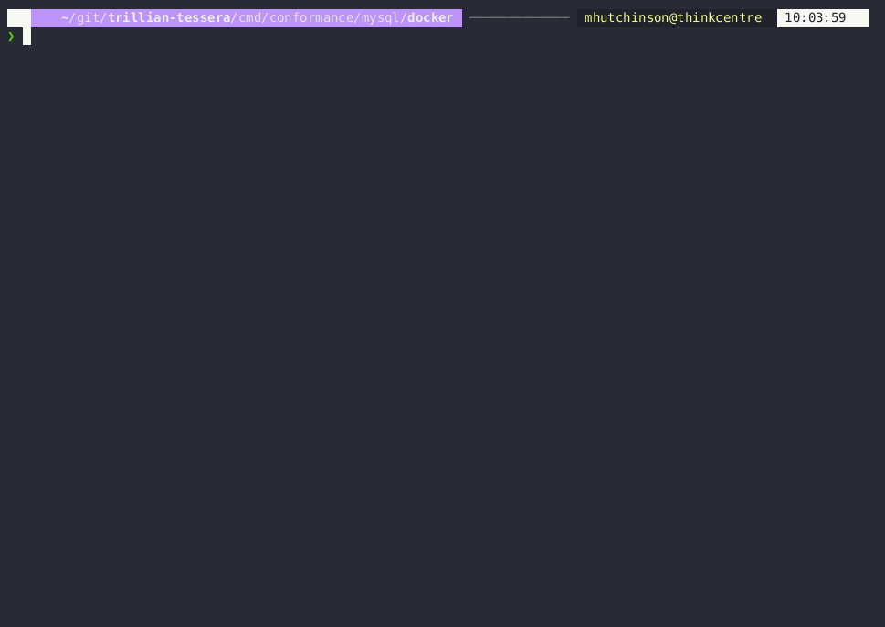

# Conformance Personalities

This directory contains personalities that serve a dual purpose:
 - To provide a simple example of a personality that can be deployed with each backend
 - To function as conformance and performance harnesses for Tessera (using the [hammer](../../internal/hammer/))

Each subdirectory contains an implementation of the same personality built on top of Tessera.
Implementations are provided that use:
 - [A local filesystem](./posix/)
 - [MySQL](./mysql/)
 - [GCP](./gcp/)
 - [AWS](deployment/live/aws/codelab/)

Each of these personalities exposes an endpoint that accepts `POST` requests at a `/add` URL.
The contents of any request body will be appended to the log, and the decimal index assigned to this newly _sequenced_ entry will be returned.

## Codelab

This codelab will help you add a few entries to a log, and read log contents.
First, you need to bring up personality (a server built with Tessera which manages the log) on the infrastructure of your choice:
 - [A local filesystem](./posix#bring-up-a-log)
 - [MySQL](./mysql#bring-up-a-log)
 - [GCP](./gcp) 
 - [AWS](./aws) 

Choose one of the implementations above and deploy it.
In the shell you are going to run this codelab in, define the following environment variables (check the logging output from the implementation you deployed, as these may have been output):
 - The write URL: `${WRITE_URL}`
 - The read URL: `${READ_URL}`
 - The log public key: `${LOG_PUBLIC_KEY}`

The commands below add entries to the log, and then show a few approaches to inspect the contents of the log.

```shell
# Add 3 entries in parallel, and wait for all requests to complete
curl -d 'one!' -H "Content-Type: application/data" -X POST ${WRITE_URL}add &
curl -d 'two!' -H "Content-Type: application/data" -X POST ${WRITE_URL}add &
curl -d 'three!' -H "Content-Type: application/data" -X POST ${WRITE_URL}add &
wait

# Check that the checkpoint is of the correct size
curl -s ${READ_URL}checkpoint

# Look at the leaves. Piping into xxd to reveal the leaf sizes.
curl -s ${READ_URL}tile/entries/000.p/3 | xxd
```

The tiles format is plain-text, but it's better to inspect the log via tooling made for this purpose:

```shell
go run github.com/mhutchinson/woodpecker@main \
  --custom_log_type=tiles \
  --custom_log_url=${READ_URL} \
  --custom_log_vkey=${LOG_PUBLIC_KEY}
```

Use arrow keys left and right to go backwards and forwards through the entries in the log.
Use `q` to quit.

Here's a demo of the codelab being followed:



