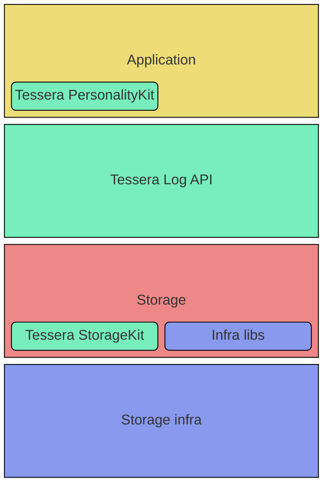

# Design docs

This directory contains design documentation for Tessera.

It's probably wise to start with the [philosophy](philosophy.md) doc first in order to establish
the context around the approach and design trade-offs made herein.

## Objective

Tessera is a library for managing Merkle trees & building transparency applications.
It is designed to embody and guide users towards the current best practices developed over time
through the implementation and operation of transparency systems at scale.

### Goals

Primary goals are to:

1. Take a simpler MVP approach compared to Trillian v1.
1. Correctly, reliably, and cheaply manage Merkle trees.
1. Enable users of the library to build safe transparency systems, conforming to the [tlog-tiles][] spec
   (or the proposed new version of CT described by the [static-ct-api][] spec).
   + Tessera means _"An individual tile, used in creating a mosaic"_!)
1. Reduce TCO of operating logs compared to Trillian v1.

### Non-goals:

1. Multi-tenancy.
1. Global "strong" deduplication of entries.

### Notable differences from Trillian v1

While there are many similarities with Trillian v1 at a high level (e.g. they both manage t-logs, they both
utilise tile structures for storing t-log data, etc.), Tessera approaches the problem in quite a different want.

The major changes from Trillian v1 are that Tessera:

* Is a library rather than a collection of microservices.
* Is strongly opinionated on how t-logs are to be exposed and served.
  + For example, Tessera will only support building t-logs which conform to [tlog-tiles][] or [static-ct-api][]
    specs, and enforces the use of [checkpoint][] spec commitments to the state of the log.
* Has a clear scope of responsibility: Tessera is only concerned with managing t-logs, anything beyond
  that is the responsibility of the application.
* Implements its storage layer much more "natively"; a much simpler abstraction which pushes more responsibility
  (and thus flexibility) down into the storage implementations.

Details on the rationale behind the trade-offs and principles which shape Tessera are provided in the 
[philosophy](philosophy.md) doc.

## Overview

Tessera is intended to be used _to build_ other, transparency related, applications, and as such does
not provide production binaries to run, but rather:

* Data storage and management libraries
  * including support libraries for authors of Tessera storage implementations
* Application support libraries ("PersonalityKit")
  * e.g. to help authors of applications which manage t-log instances, or to help authors whose
    applications need to fetch data from t-logs, or build & verify proofs, etc.

## Storage

The data managed by Tessera which represents the t-log state is persisted using one of the
concrete storage implementations are provided by this library. These particular implementations 
were selected due to expressed demand from existing Trillian users we interviewed, but others
can easily be constructed by third parties.

Each of the provided storage implementations has an associated "one-pager" design doc which offers
a detailed explanation of how it works:

* [GCP](gcp_storage.md)
* [MySQL](mysql_storage.md)
* [POSIX filesystem](posix_storage.md)

Every storage implementation is required to expose a small number of fairly high-level APIs:

* Add(): durably assign a leaf to an index in the log, return its durably assigned index
* TODO: Set(): durably assign one or more leaves to user-specified positions in the log

in addition to meeting some additional contracts:

* If the storage infrastructure is capable of being directly exposed to client (e.g. S3/GCS
  via HTTP, etc.), the Merkle tree internal node data and leaves MUST be stored according to
  the [tlog-tiles][] or [static-ct-api][] specs.
* The small number of "With Options" defined by Tessera (e.g. `WithBatching`, `WithCheckpointSigner`,
  etc.) SHOULD be supported where possible.
* Entries with assigned indices contiguous to the existing tree SHOULD be integrated into the
  t-log within single-digit seconds.

These storage APIs are intended to be high-level enough to allow implementations flexibility to act
in the most native way for the infrastructure they're targeting, rather than assuming e.g. a
transactional model which can rule out entire classes of storage or make optimisation
difficult/impossible.

[tlog-tiles]: https://c2sp.org/tlog-tiles
[tlog-checkpoint]: https://c2sp.org/tlog-checkpoint
[static-ct-api]: https://c2sp.org/static-ct-api
