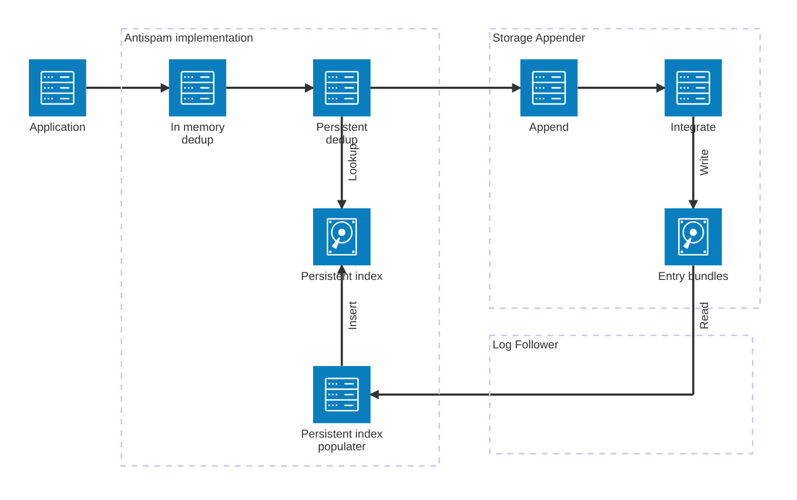

# Tessera Anti-spam

Tessera will undoubtedly be used to build transparency systems which have publicly available
write endpoints, e.g. Certificate Transparency. With such systems, there is usually an accompanying
risk that, whether by accident or malice, the write endpoints will be misused somehow - likely by
resubmitting entries which are already present in the log.

From a transparency perspective, this is unlikely to be a problem - an entry is _discoverable_ if it's
present in a log; this property doesn't diminish if there are further copies of it the log.

However, particularly for large scale logs, there is a potentially significant cost to both the log operator
(in terms of egress & storage), and to monitors/verifiers within the ecosystem (in terms of ingress, and possibly
compute & storage, too) to allowing the unfetter addition of duplicate entries to a log.

It would, therefore, be preferable to try to minimise the number of duplicate entries, and this is what
Tessera's anti-spam mechanism is intended to do.

Tessera anti-spam provides _best effort_ support for minimising duplicate entries submitted to a log.

## Non-goals

Tessera's anti-spam mechanisms are _explicitly not_ intended to provide strong/atomic deduplication, nor any
guarantee about uniqueness of entries in a log. These properties are not generally required, are
expensive, and have a profound impact on log performance.

If your transparency application needs such properties you will need to handle this in the personality.

## Overview

The anti-spam support is optional, and needs to be explicitly provisioned in the infrastructure and enabled
by the personality application (via the
[`WithAntispam`](https://pkg.go.dev/github.com/transparency-dev/tessera@main#AppendOptions.WithAntispam))
 option).

The following diagram gives a high-level overview of how it works.

Across the top, we see the chain of _decorators_ ultimately leading to the storage implementation's `Append` func.
The anti-spam implementation is part of this chain, but only performs _lookups_ here, short-circuiting and returning
a previously assigned index if match is found.

The anti-spam index data is populated asynchronously, by "following" (or "tailing") the contents of the log, 
and adding index information for new entries as they appear.

If the process of following the log falls too far behind a
configurable threshold (e.g. on
[GCP's antispam](https://pkg.go.dev/github.com/transparency-dev/tessera@main#AppendOptions.WithPushback)
implementation), the decorator will start returning `ErrPushback` to the application until such time as the
follower has caught up. This helps to prevent the anti-spam mechanism getting so far behind as to become
ineffective in preventing abuse.

## Threats / failure scenarios

### Threats:

1. Stuttering but non-malicious submission client
2. Malicious bot (e.g. feeding log contents back into the log)

### Failure scenarios:

1. Normal operation
2. Degraded anti-spam
3. Degraded integration

As currently implemented, the Tessera anti-spam implementation consists of a layered defense: 

1. An in-memory deduplication cache, followed by:
2. A persistent deduplication index.

This gives fast and cheap protection against (T1) in all failure scenarios, and falls back to the more costly interaction
with the persistent storage where necessary.
(T2) is expected to be rarer, but given that the approach is to offer best effort protection, it's important to think through
how this threat will be handled in various failure cases; we would prefer that anti-spam does not fail to block malicious
submissions exactly when we're currently overwhelmed, for example.

> [!Note]
> Note that, if running multiple personality frontents for redundancy purposes, a rapid round-robin submission of
> duplicate entries can result in a limited number of these duplicates (1 per frontend) being permitted into the log until
> the persistent deduplication index has caught up.

## Storage considerations

Tessera offers a couple of infrastructure-specific anti-spam modules (initially for AWS and GCP, but others may also be made
available in response to demand or contributions). It's expected that most anti-spam persistence implementations are going to
use some sort of transactional storage (whether KV or relational).

While the exact behaviour of individual storage infrastructure will naturally differ, in general, the performance of these storage
engines tends to degrade in the face of many competing transactions/updates, and the overhead of attempting single-row inserts tends
to push towards batching. 

However, the nature of the anti-spam storage is mapping uniformly distributed keys (`SHA256` identity hashes)
to indices in the log (`uint64` values), which means that any two batches are likely to contend for range locks.

Given these constraints, a _Follower_ approach, where we closely tail the log as it grows, using entries we find to populate the
anti-spam index will perform better than, e.g., attempting to update the index during highly concurrent calls to `Add()` or 
`SetEntryBundle()`. This is borne out by experimental evidence; early tests on GCP show that this approach delivers twice the
throughput (tested with 10% dupe traffic) compared with the "competing batched updates" approach briefly described above.

## Tuning

### In-memory cache size

Ideally, the in-memory anti-spam decorator should have a sufficiently large cache to cover the window before newly added entries are
seen by the follower and added to the persistent anti-spam storage. Fortunately, anti-spam index entries are `32+8` bytes plus overhead,
so having even a very large cache depth of 100's of 1000's of entries is not expected to be a problem.

The `tessera.WithAntispam` option allows the capacity of the in-memory cache to be configured, and internally ensures that the in-memory
cache and persistent anti-spam index are applied in the correct order.

### Persistent index

Applications should configure the push-back threshold according to their expected throughput &
log performance numbers. A reasonable starting point is probably a few seconds' worth of the peak expected log 
growth rate.  The in-memory cache should also be configured to be _at least_ this size.

Individual implementations may have other tunable options to help tailor the behaviour to the expected load.

